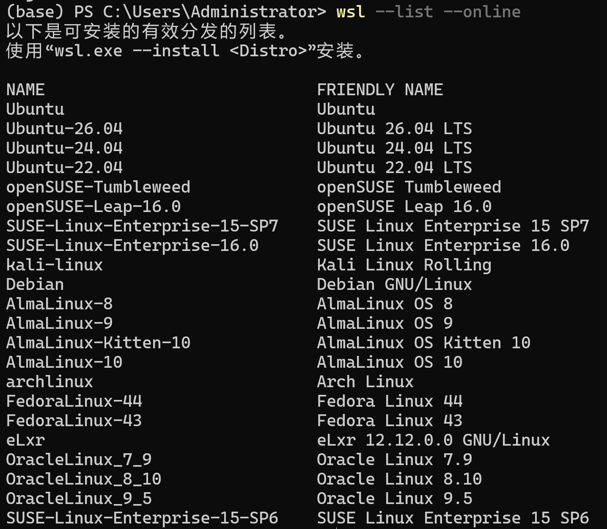

# WSL基本指令

WSL（Windows Subsystem for Linux）

下面的 WSL 命令以 PowerShell 或 Windows 命令提示符支持的格式列出。 要从 Bash/Linux 发行版的命令行运行这些命令，必须将 ``wsl`` 替换为 ``wsl.exe``。 完整的命令列表，请运行 `wsl --help`。 

## CMD

CMD（Command Prompt）

- 基于古老的 **MS-DOS**（Microsoft Disk Operator System），是 Windows 的传统命令行解释器。
- 主要用于执行简单的批处理（`.bat` 或 `.cmd` 文件）和基础系统命令。
- 功能有限，依赖外部程序（如 `findstr`、`xcopy`）完成复杂任务。

## PowerShell

- 由 Microsoft 设计，是一种现代化的 **脚本语言和 shell**（2006 年推出）。
- 基于 **.NET Framework/.NET Core**，支持面向对象和自动化管理。
- 定位为系统管理和自动化工具，尤其适合 IT 运维和开发。

## 安装WSL

```powershell
wsl --install
```

安装 WSL 和 Linux 的默认 Ubuntu 分发版

还可以使用此命令通过运行 `wsl --install <Distribution Name>`来安装其他 Linux 分发版。 对于有效的发行版名称列表，请运行 `wsl --list --online`。

```powershell
wsl --list --online
```



## 列出已安装的Linux分发版

```powershell
wsl --list --verbose
# 等价于 wsl -l -v
```

可用于列表命令的其他选项包括： `--all` 列出所有通讯组、 `--running` 仅列出当前正在运行的分发版或 `--quiet` 仅显示分发名称

(或-q)。

```powershell
wsl -l --all
wsl -l --running
wsl -l --quiet
```

  - 双横线 --：后面接完整名称，例如 --distribution，容易理解。
  - 单横线 -：后面接简写，例如 -d，输入更方便。

  比如下面两条命令意思一样：

```powershell
wsl --install --distribution Ubuntu
wsl --install -d Ubuntu
```

## 在用户主目录中启动WSL

```powershell
wsl ~
```

~`可与 wsl 一起使用，以在用户的主目录中启动。 若要从 WSL 命令提示符内从任何目录跳转回主页，可以使用以下命令： `

```powershell
cd ~
```

## 从PowerShell或CMD运行特定的Linux分发版

```powershell
wsl --distribution <Distribution Name> --user <User Name>
```

若要使用特定用户运行特定 Linux 发行版，请将 `<Distribution Name>` 替换为您首选的 Linux 发行版的名称（即 Debian），并将 `<User Name>` 替换为现有用户的名称（即 root）。 如果 WSL 分发中不存在用户，将收到错误。 若要打印当前用户名，请使用一下命令 

```powershell
whoami
```

## 更新WSL

```powershell
wsl --update
```

将 WSL 版本更新为最新版本。 选项包括：

- `--web-download`：从 GitHub 下载最新更新，而不是 Microsoft 商店。

## 检查WSL状态

```powershell
wsl --status
```

请参阅有关 WSL 配置的常规信息，例如默认分发类型、默认分发和内核版本。

## 检查WSL版本

```powershell
wsl --version
```

## Help命令

```powershell
wsl --help
```

请参阅 WSL 可用的选项和命令列表。

## 以特定用户身份运行

```powershell
wsl --user <Username>
```

## 更改分发版的默认用户

```powershell
<DistributionName> config --default-user <Username>
```

更改分发版登录的默认用户。 用户必须已存在于分发中，才能成为默认用户。

## 关机

```powershell
wsl --shutdown
```

停止所有正在运行的分发版，同时关闭 WSL 2 的后台虚拟机。

## 终止

```powershell
wsl --terminate <DistributionName>
```

只停止指定分发版，其他分发版可以继续运行。

## 使用WSL访问网络应用程序

默认情况下，WSL 使用 基于 NAT 的体系结构，建议尝试新的 镜像网络模式 来获取最新的功能和改进。

### NAT

 NAT（网络地址转换 Network Address Translation）就是：数据经过网络出口时，把其中的 IP 地址转换一下，让内部设备能够通过出口访问外部网络。

  以 WSL 的 NAT 网络模式为例，WSL 中的 Linux 有自己的内部 IP。它访问外网时，Windows 会替它转发数据，并转换地址：

  WSL 中的 Ubuntu（内部 IP）
          ↓
  Windows（转换地址、转发数据）
          ↓
  外部网络

  可以把它理解为公司的总机：

  - WSL 是内部员工，有自己的分机号。
  - Windows 是总机，帮内部员工接通外部电话。
  - 回应到达后，总机根据记录，把回应交回对应的分机。

### 镜像网络模式

### 标记IP地址

确定用于通过 WSL 运行的 Linux 分发的 IP 地址时，需要考虑两种情况：

#### Linux分发版IP

**方案一：** 从 Windows 主机的角度来看，你想要查询通过 WSL2 运行的 Linux 分发版 IP 地址，以便 Windows 主机上的程序可以连接到分发（实例）中运行的服务器程序。

Windows 主机可以使用命令： 

```powershell
wsl.exe --distribution Ubuntu hostname -I
```

在 PowerShell 中，通常可以省略可执行文件的 .exe 后缀，两种写法调用的是同一个程序

```powershell
# 查看主机名	
hostname
# 查看主机的IP地址(带参数的是Linux指令，Windows中用ipconfig)
hostname -I
```

* 小写 -i    查询主机名解析得到的 IP，可能是回环地址

* 大写 -I    列出网络接口上的 IP 地址，排除回环地址

回环地址就是“指向自己这台机器”的特殊 IP 地址。 访问它时，数据在本机内部处理，不会发到外部网络。

  最常见的是：

  - IPv4：127.0.0.1
  - IPv6：::1
  - localhost：通常解析到回环地址的主机名。

 IPv4 和 IPv6 是互联网协议（IP）的两个版本，都用来给网络中的设备分配地址，让数据能找到目的地。

联网设备越来越多，IPv4 的地址空间不够用，所以设计了地址空间大得多的 IPv6。可以把它理解为：原来的“门牌号码”数量有限，换一套能容纳更多号码的规则。

  IPv6 地址中的 :: 是省略连续全零分组的写法。例如：

  完整：0000:0000:0000:0000:0000:0000:0000:0001
  简写：::1

  一台电脑可以同时拥有 IPv4 和 IPv6 地址，两者并存很常见。另外，IPv6 中的“6”代表协议版本，不代表网速是 IPv4 的 1.5 倍。

#### Windows主机IP

**方案二：** 通过 WSL2（实例）在 Linux 分发中运行的程序想要知道 Windows 主机的 IP 地址，以便 Linux 程序可以连接到 Windows 主机服务器程序。

WSL2 Linux 用户可以使用命令：

```powershell
ip route show | grep -i default | awk '{ print $3}'
```

 这条命令的作用是：从 Linux 路由表中找出默认路由，提取它的网关 IP 地址。 常用于查看系统通过哪个网关访问其他网络。

  它分为三步，| 是管道符，把左边命令的输出交给右边命令处理：

① ip route show：显示路由表

  路由表告诉系统：“发往某个地址的数据，应该走哪条路。”

  示例输出：

  default via 172.28.112.1 dev eth0
  172.28.112.0/20 dev eth0 proto kernel scope link src 172.28.123.45

| default          | 默认路由：没有更具体的匹配路线时，就走这里 |
| ---------------- | ------------------------------------------ |
| via 172.28.112.1 | 通过网关 172.28.112.1 转发                 |
| dev eth0         | 使用名为 eth0 的网络接口                   |

② grep -i default：筛选包含 default 的行

 - grep：按文本模式筛选行。
  - -i：忽略大小写，例如 default、DEFAULT 都能匹配。
  - default：要查找的文本。

 处理后只剩下：

  default via 172.28.112.1 dev eth0

③ awk '{ print $3}'：输出每行的第三列

awk 是文本处理工具，默认按照连续空格、制表符等空白来划分字段：

| default | via  | 172.28.112.1 | dev  | eth0 |
| ------- | ---- | ------------ | ---- | ---- |
|   $1      |  $2    |    $3           |  $4     |   $5    |

 - 单引号 '...'：让 shell 把里面的内容原样交给 awk，避免提前解释 $3。
  - { ... }：awk 要执行的动作。
  - print：输出。
  - $3：当前行的第三个字段，不是固定代表 IP；这条命令依赖它恰好位于第三列。

#### awk

